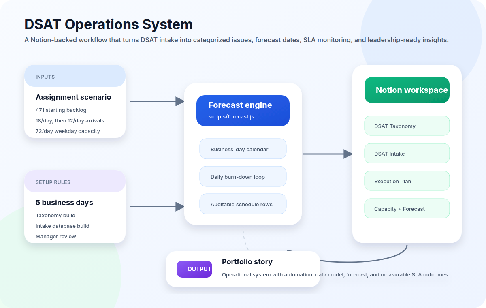
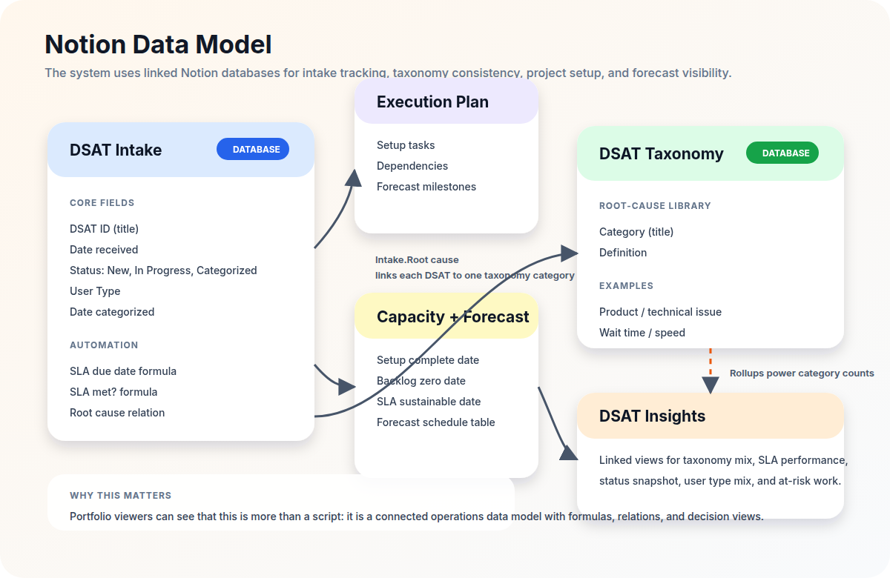
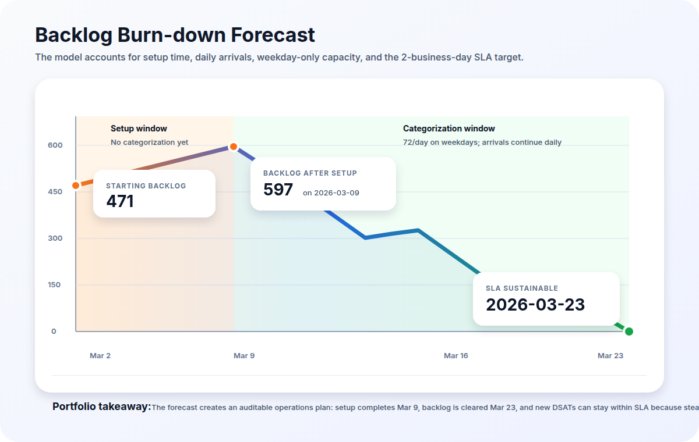
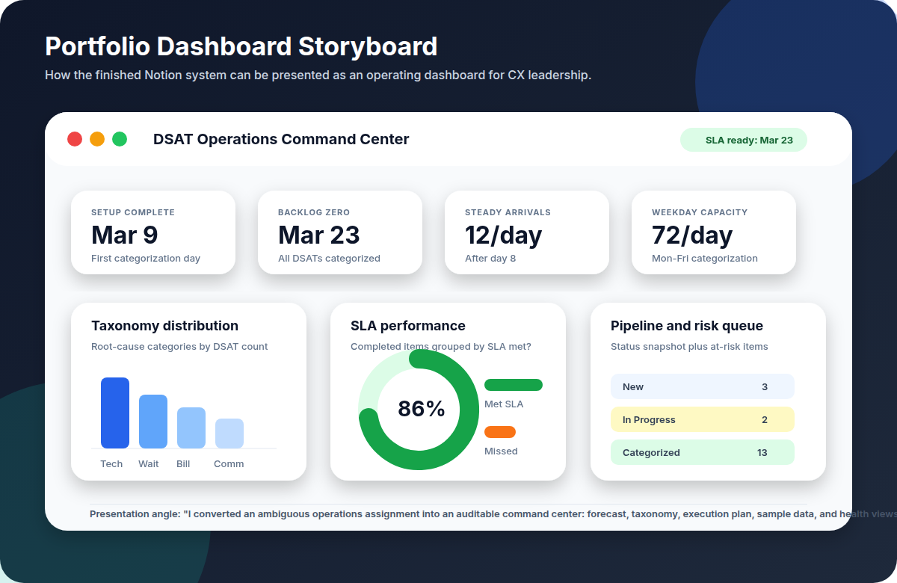

# Portfolio Visuals for the DSAT Operations System

This folder adds portfolio-ready visuals that explain the system from four angles:
workflow, data model, forecast logic, and the executive dashboard story. They are
shown as PNG previews for broad compatibility. Editable SVG source files are kept
in `docs/visuals/`.

For usage-focused wireframes and screenshot-style mockups, see
[`usage-wireframes.md`](usage-wireframes.md).

## 1. System workflow

Use this visual to open the case study. It shows how assignment inputs flow into
the forecast engine, then into automated Notion setup and operating outputs.

**Story to tell:** "I built an operations system that converts DSAT backlog
rules into a working Notion workspace with forecast dates, intake tracking, and
leadership-ready insights."

## 2. Notion data model

Use this visual when explaining the product architecture. It highlights the
Notion databases, formulas, relations, rollups, and views that make the system
auditable.

**Story to tell:** "This is not just a spreadsheet. The intake database links to
a taxonomy, formulas compute SLA fields, the execution plan stores milestones,
and dashboard views summarize performance."

## 3. Forecast burn-down

Use this visual to show the quantitative operations logic.

**Scenario shown:**

| Metric | Value |
| --- | --- |
| Start date | 2026-03-02 |
| Initial backlog | 471 DSATs |
| Setup complete | 2026-03-09 |
| Backlog at categorization start | 597 DSATs |
| Backlog zero date | 2026-03-23 |
| SLA sustainable date | 2026-03-23 |

**Story to tell:** "I modeled arrivals and capacity day by day, including
weekend constraints, so operations leaders can see exactly when the backlog is
cleared and when the 2-business-day SLA becomes sustainable."

## 4. Dashboard storyboard

Use this visual as the portfolio hero image or slide thumbnail. It reframes the
Notion workspace as a command center for monitoring the system.

**Story to tell:** "The final system gives CX leadership one place to track key
dates, taxonomy distribution, SLA performance, pipeline status, and at-risk
items."

## Suggested portfolio layout

1. **Problem:** A DSAT backlog needs categorization, SLA tracking, and a
   forecast for when service levels become sustainable.
2. **System design:** Show the workflow and data model visuals.
3. **Forecast logic:** Show the burn-down visual and cite the key dates.
4. **Usage walkthrough:** Show the wireframes and screenshot mockups from
   `docs/usage-wireframes.md`.
5. **Operational outcome:** Show the dashboard storyboard and explain the daily
   and weekly operating cadence.
6. **Technical implementation:** Link to the scripts:
   - `scripts/forecast.js`
   - `scripts/notion-setup.js`
   - `scripts/add-forecast-table.js`
   - `scripts/create-insights-page.js`

## Reuse notes

- PNG previews are under `docs/visuals/png/`.
- Editable SVG source files are under `docs/visuals/`.
- They use the documented scenario from `PROJECT_REFERENCE.md` and the forecast
  output from `START_DATE=2026-03-02 npm run forecast`.
- To make edits, update the SVG source and regenerate the PNG preview.
