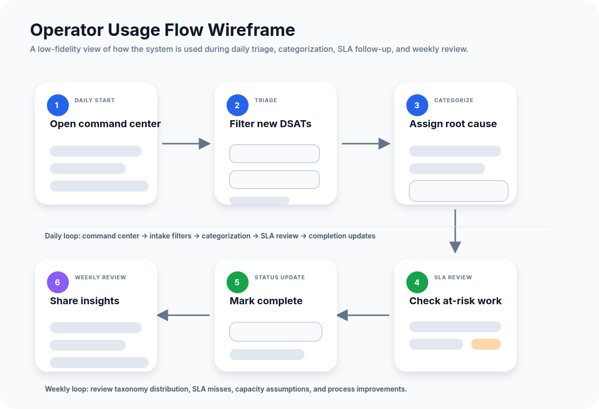
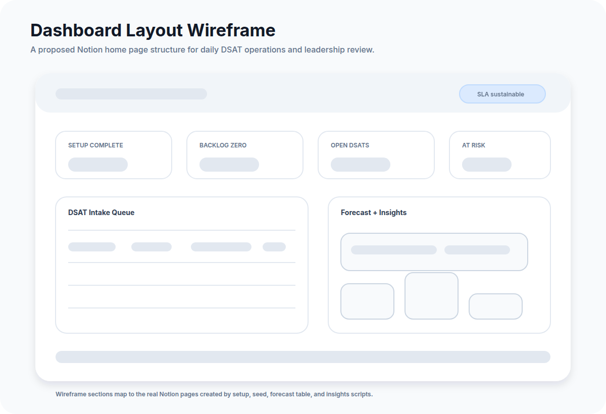
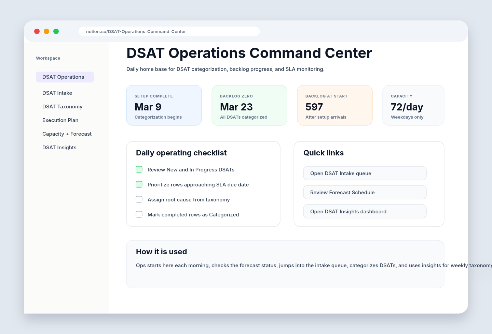
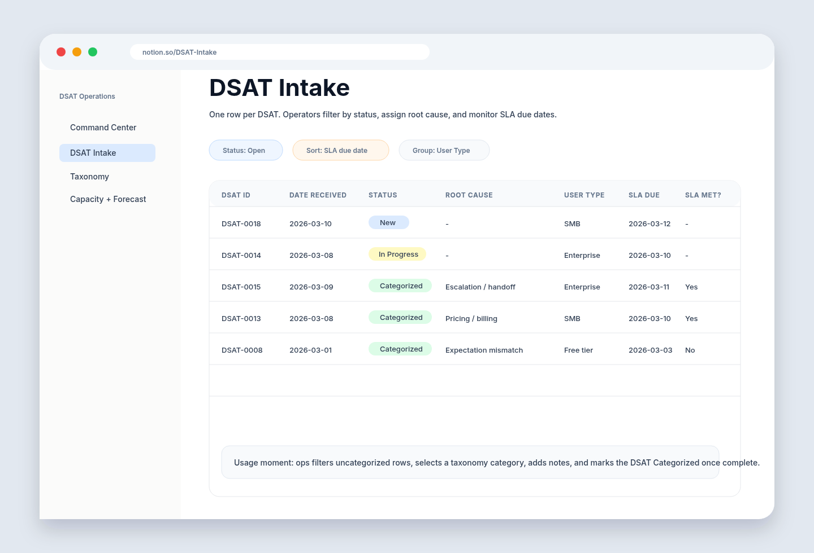
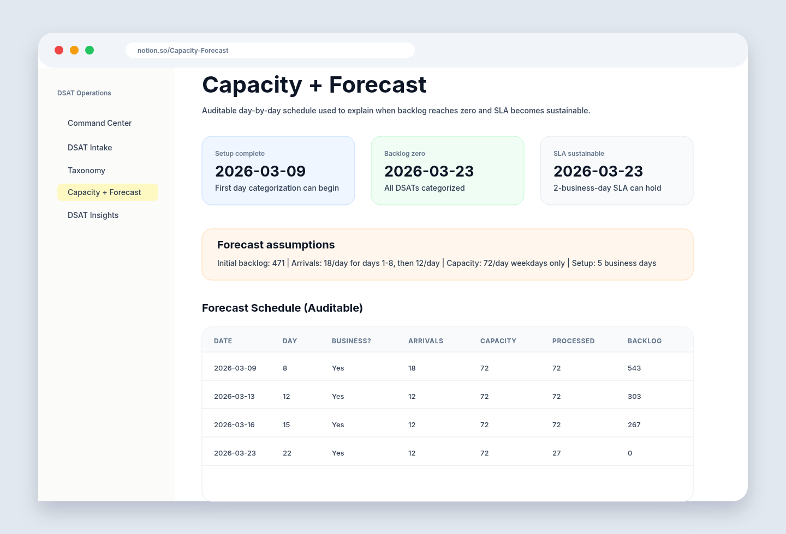

# Usage Wireframes and Screenshot Mockups

These assets show how the DSAT Operations system would be used day to day. The
wireframes communicate interaction flow, while the screenshot mockups give a
portfolio viewer a realistic feel for the Notion workspace. PNG previews are
shown below for broad compatibility; editable SVG sources live next to them in
`docs/visuals/`.

## Wireframe: operator usage flow

**What it shows:** A CX operations user starts in the command center, filters
open DSATs, categorizes each item, checks SLA risk, marks work complete, and
uses insights for weekly review.

## Wireframe: dashboard layout

**What it shows:** A proposed home page layout with top-level metrics, an intake
queue, forecast context, taxonomy trends, and SLA risk areas.

## Screenshot mockup: command center

**How it is used:** Ops opens this page each morning to see the key dates, daily
checklist, and quick links into the working databases.

## Screenshot mockup: DSAT intake queue

**How it is used:** Operators filter open work, sort by SLA due date, assign root
causes, update statuses, and use formulas to identify SLA misses.

## Screenshot mockup: forecast review

**How it is used:** Leaders review the assumptions and auditable schedule to
understand when setup completes, when backlog reaches zero, and when the SLA is
sustainable.

## Suggested portfolio walkthrough

1. Start with the **operator usage flow** to explain the human workflow.
2. Show the **dashboard layout wireframe** to explain the intended information
   architecture.
3. Use the **command center screenshot** as the entry point.
4. Walk through the **intake queue screenshot** to show daily categorization.
5. End with the **forecast review screenshot** to show operational rigor and
   leadership reporting.

## Source files

The editable SVG versions are:

- `visuals/wireframe-operator-flow.svg`
- `visuals/wireframe-dashboard-layout.svg`
- `visuals/screenshot-command-center.svg`
- `visuals/screenshot-intake-queue.svg`
- `visuals/screenshot-forecast-review.svg`
